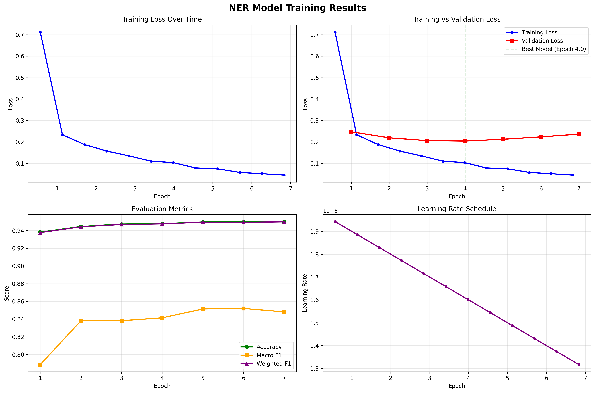

# Auto-NER: Named Entity Recognition & POS Tagging with BERT

A comprehensive implementation of Named Entity Recognition (NER) and Part-of-Speech (POS) tagging using transformer-based models (BERT) trained on the CoNLL-2003 dataset.

## Overview

This project implements two token classification models:

1. **Named Entity Recognition (NER)**: Identifies and classifies named entities (persons, organizations, locations, and miscellaneous entities) in text
2. **Part-of-Speech (POS) Tagging**: Classifies words by their grammatical parts of speech

Both models leverage BERT (Bidirectional Encoder Representations from Transformers) as the base architecture and are fine-tuned on the CoNLL-2003 dataset.

## Features

- BERT-based token classification for NER and POS tagging
- Training with early stopping to prevent overfitting
- Comprehensive evaluation metrics (F1, Precision, Recall, Accuracy)
- Visualization of training metrics
- Pipeline-based inference for easy deployment
- Support for GPU acceleration (CUDA)

## Dataset

**CoNLL-2003 Dataset** (`eriktks/conll2003`)

The dataset contains annotated news articles with:
- 14,041 training samples
- 3,250 validation samples
- 3,453 test samples

### NER Labels
- `O`: Outside any named entity
- `B-PER`, `I-PER`: Person names (Beginning, Inside)
- `B-ORG`, `I-ORG`: Organizations (Beginning, Inside)
- `B-LOC`, `I-LOC`: Locations (Beginning, Inside)
- `B-MISC`, `I-MISC`: Miscellaneous entities (Beginning, Inside)

### POS Tags
47 different Penn Treebank POS tags including:
- Nouns (NN, NNP, NNPS, NNS)
- Verbs (VB, VBD, VBG, VBN, VBP, VBZ)
- Adjectives (JJ, JJR, JJS)
- And more...

## Installation

### Prerequisites

- Python 3.8+
- CUDA-compatible GPU (recommended for training)

### Setup

1. Clone the repository:
```bash
git clone https://github.com/yourusername/auto-ner.git
cd auto-ner
```

2. Create a virtual environment:
```bash
python -m venv .venv
source .venv/bin/activate  # On Windows: .venv\Scripts\activate
```

3. Install dependencies:
```bash
pip install -r requirements.txt
```

## Usage

### Named Entity Recognition (NER)

Open and run `model_train.ipynb`:

```python
from transformers import pipeline, AutoModelForTokenClassification, AutoTokenizer

# Load the trained model
model = AutoModelForTokenClassification.from_pretrained('./ner_output/checkpoint-4390')
tokenizer = AutoTokenizer.from_pretrained('bert-base-uncased')

# Create NER pipeline
ner_pipeline = pipeline(
    task='ner',
    model=model,
    tokenizer=tokenizer,
    aggregation_strategy='first'
)

# Make predictions
text = 'Barack Obama and Elon Musk met at Google headquarters in California yesterday.'
results = ner_pipeline(text)
print(results)
```

### Part-of-Speech Tagging

Open and run `pos_model_train.ipynb`:

```python
from transformers import pipeline, AutoModelForTokenClassification, AutoTokenizer

# Load the trained model
model = AutoModelForTokenClassification.from_pretrained('./ner_output/checkpoint-6146')
tokenizer = AutoTokenizer.from_pretrained('bert-base-uncased')

# Create POS tagging pipeline
pos_pipeline = pipeline(
    task='token-classification',
    model=model,
    tokenizer=tokenizer,
    aggregation_strategy='first'
)

# Make predictions
text = 'Barack Obama and Elon Musk met at Google headquarters in California yesterday.'
results = pos_pipeline(text)
```

## Model Architecture

Both models use `bert-base-uncased` as the base architecture:

- **Base Model**: BERT (110M parameters)
- **Tokenizer**: WordPiece tokenization
- **Classification Head**: Linear layer for token classification
- **Training**: Fine-tuned with AdamW optimizer

### Training Configuration

- Learning Rate: 2e-5
- Batch Size: 16 (train and eval)
- Max Epochs: 20
- Early Stopping: 3 epochs patience
- Weight Decay: 0.01
- Mixed Precision: FP16

## Results

### Named Entity Recognition (NER)

**Test Set Performance:**
- Recall: 90.76%
- Precision: 89.91%
- F1 Score: 90.33%
- Accuracy: 98.04%

Training converged after 6 epochs with early stopping.

### Part-of-Speech Tagging

**Test Set Performance:**
- Accuracy: 94.24%
- Macro F1: 86.09%
- Weighted F1: 94.19%

Training converged after 7 epochs with early stopping.

### Training Visualizations

Both notebooks generate comprehensive training visualizations including:
- Training loss curves
- Validation loss comparison
- Evaluation metrics (accuracy, F1 scores)
- Learning rate schedules



## Project Structure

```
auto-ner/
├── model_train.ipynb          # NER model training notebook
├── pos_model_train.ipynb      # POS tagging model training notebook
├── requirements.txt           # Python dependencies
├── training_results.png       # Training visualization
├── training_results_professional.png
├── README.md                  # This file
├── .venv/                     # Virtual environment
└── ner_output/               # Model checkpoints (generated during training)
    └── checkpoint-*/         # Saved model checkpoints
```

## Key Dependencies

- `transformers==4.57.1`: Hugging Face Transformers library
- `datasets==4.4.1`: Dataset loading and processing
- `torch==2.9.1+cu126`: PyTorch with CUDA support
- `evaluate==0.4.6`: Model evaluation metrics
- `seqeval==1.2.2`: Sequence labeling evaluation
- `scikit-learn==1.7.2`: Machine learning utilities
- `matplotlib==3.10.7`: Visualization

For a complete list of dependencies, see `requirements.txt`.

## Notebooks

### 1. model_train.ipynb
Trains the NER model with the following steps:
1. Load CoNLL-2003 dataset
2. Preprocess and tokenize data
3. Initialize BERT model for token classification
4. Train with early stopping
5. Evaluate on test set
6. Create inference pipeline
7. Visualize training metrics

### 2. pos_model_train.ipynb
Trains the POS tagging model with:
1. Load CoNLL-2003 dataset (POS tags)
2. Preprocess and tokenize data
3. Initialize BERT model for POS classification
4. Train with early stopping
5. Evaluate on test set
6. Create inference pipeline

## GPU Support

The project supports NVIDIA GPUs with CUDA 12.6. Training on GPU significantly reduces training time. If no GPU is available, the models will fall back to CPU training (much slower).

## License

This project is for educational purposes as part of the Text Mining course at Seneca College.

## Acknowledgments

- CoNLL-2003 dataset creators
- Hugging Face team for the Transformers library
- BERT paper authors (Devlin et al., 2018)

## Future Improvements

- Add support for custom datasets
- Implement CRF layer for sequence dependencies
- Add model deployment scripts
- Include model compression techniques
- Support for multilingual models
